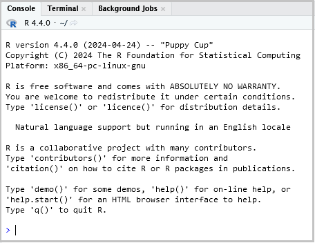

# Duke Computing Cluster (DCC)

## Installation of R Packages

The following instructions guide the installation of R packages in a DCC command line or OnDemand RStudio session.  Several cases are treated, including:

<ul>
<li>Base case (package is available on CRAN, with no dependencies)</li>
<li>Package with dependencies</li>
<li>Installing from a local file (not available on CRAN or custom package)</li>
<li>Installing a package for Slurm batch processing</li>
<li>Installing a past version of a package</li>
</ul>

## DCC command line

In an interactive DCC session, you enter commands at the OS (Linux) command line.   One sequence of commands (entered at the OS $ prompt) is:

[<span style="background-color: gray;">]: #
````
$ module load R/4.4.0
$ R
````
[</span>]: #

These specify the version of R to load, launch R, and present the R command prompt (>).

## OnDemand RStudio session

OnDemand RStudio presents an RStudio session that is executing on the DCC.  RStudio presents several window panes.  We will use the one containing Console and Terminal tabs.  Figure 1 is an example Console/Terminal window.  R commands are to be entered in the Console tab at the > prompt.  Operating system commands are to be entered in the Terminal tab at the $ (Linux) prompt. 

<br>
<figure>
<table>
<td>

</td>
</table>
<figcaption>Figure 1, RStudio Console and Terminal window</figcaption>
</figure>
  
## Background

To install a package, source files are downloaded from a repository then decompressed, compiled, and saved in a local directory.  Various R commands allow you to review and specify the current source repository, install a package, and load installed packages.  To <b>review the current source repository</b> (where, by default, packages are downloaded from), use the ````options("repos")```` command.  Example:

[<span style="background-color: gray;">]: #
````
> options("repos")
````
[</span>]: #

Result:

[<span style="background-color: gray;">]: #
````
$repos
                                                           CRAN 
"https://packagemanager.rstudio.com/all/__linux__/focal/latest" 
````
[</span>]: #

To <b>specify an alternate repository</b>, use the command ````options(repos=”x”)````.  The following example sets the target repository to the Duke CRAN mirror:

[<span style="background-color: gray;">]: #
````
> options(repos="https://archive.linux.duke.edu/cran/")
````
[</span>]: #

To <b>install a package</b>, use the command

[<span style="background-color: gray;">]: #
````
> install.packages(package="x", lib="y", repos="z")
````
[</span>]: #

This instructs R to search for package ````x```` in repository ````z```` and to install it in local directory ````y````.  ````y```` and ````z```` may be omitted, in which case the current values of ````.libPaths()```` and ````options("repos")````, respectively, will be used.

To <b>review the current local package installation and search directories</b>, use ````.libPaths()````.  Note that, in the example below, complete paths (beginning at /) are specified.  If relative paths are used, they are referenced from the current working directory, which is reported by getwd().  Example:

[<span style="background-color: gray;">]: #
````
> .libPaths()
[1] "/hpc/home/tjb48/R/x86_64-pc-linux-gnu-library/4.4"
[2] "/usr/local/lib/R/site-library"                    
[3] "/usr/local/lib/R/library"
````
[</span>]: #

To <b>include an additional directory in the library search path</b>, use ````.libPaths()```` as follows (note that, in this example, the additional directory ````/hpc/group/rescomp/tjb48/rlib```` is placed at the head of the list):

[<span style="background-color: gray;">]: #
````
> .libPaths(c("/hpc/group/rescomp/tjb48/rlib", .libPaths()))
````
[</span>]: #

The new search path is:

[<span style="background-color: gray;">]: #
````
> .libPaths()
[1] "/hpc/group/rescomp/tjb48/rlib"
[2] "/hpc/home/tjb48/R/x86_64-pc-linux-gnu-library/4.4"
[3] "/usr/local/lib/R/site-library"
[4] "/usr/local/lib/R/library"   
````
[</span>]: #

This path is also used by ````install.packages()```` when ````repos```` is not specified.  In the above example, ````install.packages("x")```` will install package ````x```` in ````/hpc/group/rescomp/tjb48/rlib````.

To <b>load a package</b>, use ````library(package="x", lib.loc="y")````. If ````lib.loc```` is specified, then directory ````y```` is searched for a subdirectory with name equal to ````x````.  If ````y```` is a relative path (does not begin with /) then the current working directory, as reported by ````getwd()````, is searched for subdirectory ````y````, then a subdirectory named ````x```` is searched for within ````y````.  If ````lib.loc```` is not specified, then ````.libPaths()```` directories are searched for a subdirectory named ````x````.

Note that, when loading a package, the ````library()```` function searches the directory you specify, either using the ````lib.loc```` parameter or through ````.libPaths()```` directories, for a subdirectory with name equal to the specified package then loads functions, help files, and related resources contained in the first appropriately named subdirectory it finds.  How the package subdirectory came to be in its current state is not of concern to ````library()````, only that it is a properly constructed package directory.  Copying a properly constructed package subdirectory from one R installation to another (of like version) makes it available for loading by ````library()````.

## Package installation

## Base case – standard repository, package with no dependencies

Space in your ````/hpc/home```` directory (the default location that R attempts to use) is limited and will likely be insufficient to contain more than a handful of packages.  Available space is much greater in ````/hpc/group```` and this top level directory should be used.  First, on the Terminal tab, create a subdirectory within your group's ````/hpc```` directory, with name equal to your net ID.  Within your net ID directory, create a subdirectory called ````rlib````.  This subdirectory will contain your installed, compiled packages.  Example:

[<span style="background-color: gray;">]: #
````
$ mkdir /hpc/your_group/your_netID
$ mkdir /hpc/your_group/your_netID/rlib
````
[</span>]: #

Now, on the Console tab, install your package:

[<span style="background-color: gray;">]: #
````
> options(repos="https://archive.linux.duke.edu/cran/")
> install.packages("packageOfInterest", lib="/hpc/group/your_group/your_netID/rlib")
````
[</span>]: #

Test with:

[<span style="background-color: gray;">]: #
````
> library(packageOfInterest, lib.loc="/hpc/group/your_group/your_netID/rlib")
````
[</span>]: #

## Package with dependencies

In many cases, functions in one package refer to functions in another package.  This constitutes a dependency.  When a source repository and target directory are specified, ````install.packages()````, by default, attempts to install dependent packages.  The source repository can be specified using the ````repos```` parameter of ````install.packages()```` or by setting the ````repos```` option with ````options(repos=)````.  The ````lib```` parameter of ````install.packages()```` specifies the target installation directory, where the package being installed and dependent packages will be installed.  Note that the behavior described here can be modified using the  ````dependencies```` parameter of ````install.packages()````.  The following example illustrates a common use of library paths, package installation, and package loading when dependencies exist.  If package ````pkgA```` requires package ````pkgB```` then an attempt to install ````pkgA```` will cause an attempt to install ````pkgB````.  Once installed, loading ````pkgB```` requires that its location be specified in ````.libPaths()````.  Otherwise, it cannot be located, will not be loaded, and will cause attempts to load ````pkgA```` to fail.

[<span style="background-color: gray;">]: #
````
> options(repos="https://archive.linux.duke.edu/cran/")
> .libPaths(c("/hpc/group/your_group/your_netID/rlib", .libPaths())
> install.packages("pkgA", lib="/hpc/group/your_group/your_netID/rlib")
> library(pkgA)
````
[</span>]: #

Include the above ````lib=```` parameter and ````.libPaths()```` command in any scripts that require the installed package.  Otherwise, R will not be able to load it and its dependencies.

## Installing a package from a local (non-CRAN) file

You may want to install a package that is not available on CRAN.  Perhaps you are developing your own package and need to test loading it prior to publishing on CRAN.  To do this, you first download the package source then install from that file (consider the note on copying package subdirectories under the background section, above).  This method will be illustrated by an example.  A package, named ````feXTXc````, is available as a gzip file at the githup repo <a href=https://github.com/tbalmat/StatisticsAndComputation/blob/master/FixedEffectsRegression/RPackage>https://github.com/tbalmat/StatisticsAndComputation/blob/master/FixedEffectsRegression/RPackage</a>.

The name of the file is ````feXTXc_1.0.tar.gz````.  Note that gzip is the standard distribution format of R source package files.  Using the Terminal and Console tabs within RStudio, do the following:

<ol>
<li>
If you have not created a package subdirectory within your group structure, do so now with the following commands (use the Terminal tab):

[<span style="background-color: gray;">]: #
````
$ mkdir /hpc/group/your_group/your_netID
$ mkdir /hpc/group/your_group/your_netID/rlib
````
[</span>]: #
</li>
<li>
Download the package to your current Linux directory (using the Terminal tab):

[<span style="background-color: gray;">]: #
````
$ wget https://raw.githubusercontent.com/tbalmat/StatisticsAndComputation/master/FixedEffectsRegression/RPackage/feXTXc_1.0.tar.gz
````
[</span>]: #

Result:

[<span style="background-color: gray;">]: #
````
--2022-06-17 12:42:52--  https://raw.githubusercontent.com/tbalmat/StatisticsAndComputation/master/FixedEffectsRegression/RPackage/feXTXc_1.0.tar.gz

Resolving raw.githubusercontent.com (raw.githubusercontent.com)... 185.199.111.133, 185.199.109.133, 185.199.108.133, ...

Connecting to raw.githubusercontent.com (raw.githubusercontent.com)|185.199.111.133|:443... connected.

HTTP request sent, awaiting response... 200 OK

Length: 35481 (35K) [application/octet-stream]

Saving to: ‘feXTXc_1.0.tar.gz’

feXTXc_1.0.tar.gz              100%[==================================================>]  34.65K  --.-KB/s    in 0.009s  

2022-06-17 12:42:52 (3.65 MB/s) - ‘feXTXc_1.0.tar.gz’ saved [35481/35481]
````
[</span>]: #
</li>
<li>
Install the package (using the Console tab - note that the current R working directory is the same as the current Linux directory):

[<span style="background-color: gray;">]: #
````
> install.packages("feXTXc_1.0.tar.gz", repos=NULL, lib="/hpc/group/your_group/your_netID/rlib")
````
[</span>]: #

Result:

[<span style="background-color: gray;">]: #
````
* installing *source* package ‘feXTXc’ ...
** using staged installation
** libs
g++ -std=gnu++14 -I"/usr/local/lib/R/include" -DNDEBUG  -I'/usr/local/lib/R/site-library/Rcpp/include' -I/usr/local/include   -fpic  -g -O2 -fstack-protector-strong -Wformat -Werror=format-security -Wdate-time -D_FORTIFY_SOURCE=2 -g  -c RcppExports.cpp -o RcppExports.o
g++ -std=gnu++14 -I"/usr/local/lib/R/include" -DNDEBUG  -I'/usr/local/lib/R/site-library/Rcpp/include' -I/usr/local/include   -fpic  -g -O2 -fstack-protector-strong -Wformat -Werror=format-security -Wdate-time -D_FORTIFY_SOURCE=2 -g  -c cholInvDiag.cpp -o cholInvDiag.o
g++ -std=gnu++14 -I"/usr/local/lib/R/include" -DNDEBUG  -I'/usr/local/lib/R/site-library/Rcpp/include' -I/usr/local/include   -fpic  -g -O2 -fstack-protector-strong -Wformat -Werror=format-security -Wdate-time -D_FORTIFY_SOURCE=2 -g  -c choleskyDecomp.cpp -o choleskyDecomp.o
g++ -std=gnu++14 -I"/usr/local/lib/R/include" -DNDEBUG  -I'/usr/local/lib/R/site-library/Rcpp/include' -I/usr/local/include   -fpic  -g -O2 -fstack-protector-strong -Wformat -Werror=format-security -Wdate-time -D_FORTIFY_SOURCE=2 -g  -c choleskyXInverse.cpp -o choleskyXInverse.o
g++ -std=gnu++14 -I"/usr/local/lib/R/include" -DNDEBUG  -I'/usr/local/lib/R/site-library/Rcpp/include' -I/usr/local/include   -fpic  -g -O2 -fstack-protector-strong -Wformat -Werror=format-security -Wdate-time -D_FORTIFY_SOURCE=2 -g  -c feXTXc-Yest.cpp -o feXTXc-Yest.o
g++ -std=gnu++14 -I"/usr/local/lib/R/include" -DNDEBUG  -I'/usr/local/lib/R/site-library/Rcpp/include' -I/usr/local/include   -fpic  -g -O2 -fstack-protector-strong -Wformat -Werror=format-security -Wdate-time -D_FORTIFY_SOURCE=2 -g  -c feXTXc.cpp -o feXTXc.o
g++ -std=gnu++14 -shared -L/usr/local/lib/R/lib -L/usr/local/lib -o feXTXc.so RcppExports.o cholInvDiag.o choleskyDecomp.o choleskyXInverse.o feXTXc-Yest.o feXTXc.o -L/usr/local/lib/R/lib -lR
installing to /hpc/group/rescomp/tjb48/rlib/00LOCK-feXTXc/00new/feXTXc/libs
** R
** byte-compile and prepare package for lazy loading
** help
*** installing help indices
** building package indices
** testing if installed package can be loaded from temporary location
** checking absolute paths in shared objects and dynamic libraries
** testing if installed package can be loaded from final location
** testing if installed package keeps a record of temporary installation path
* DONE (feXTXc)
````
[</span>]: #

Note how source files are compiled using local compilers, linkers, and OS libraries.  This is a key mechanism for ensuring portability of R packages across platforms and versions.
</li>
<li>
Test loading of the package (Console tab - note the specification of a directory from which to load.  It is, of course, the same directory specified during installation.):

[<span style="background-color: gray;">]: #
````
> library(feXTXc, lib.loc="/hpc/group/your_group/your_netID/rlib")
````
[</span>]: #
</li>
<li>
Delete the downloaded package file, since it is no longer needed (using the Terminal tab):

[<span style="background-color: gray;">]: #
````
$ rm feXTXc_1.0.tar.gz
````
[</span>]: #
</li>
</ol>

Notes:

<ol>
<li>
An alternative to downloading the package source file is to specify its URL directly in the <code>install.packages()</code> command, as in:

[<span style="background-color: gray;">]: #
````
> install.packages("https://raw.githubusercontent.com/tbalmat/StatisticsAndComputation/master/FixedEffectsRegression/RPackage/feXTXc_1.0.tar.gz", repos=NULL, lib="/hpc/group/your_group/your_netID/rlib")
````
[</span>]: #
</li>
<li>
When installing from a local source file, instead of from a repository, <code>install.packages("pkg", lib="x", repos=NULL)</code> does not install dependent packages.  They must be installed independently.  When loading a package, all dependent packages must appear in <code>.libPaths()</code> directories, even when the <code>lib.loc</code> parameter is specified.<br>
</li>
<br>
<li>
<code>remotes:install_github()</code> can also be ued to install packages from github repositories.
</li>
</ol>

## Installing a package for Slurm batch processing

Within a Slurm batch, R scripts are generally executed with the ````Rscript```` command.  Prior to executing ````Rscript````, a version of R must be loaded.  At present, several versions are available on the DCC.  Our example will use version 4.4.0.  Any package referenced in a ````library()```` call within an R script must first be installed.  We will use an interactive R session to install a package, making it available for loading in R scripts.  Because package versions and dependent system objects may vary by R version, we will install and load packages into and from a directory dedicated to version 4.4.0.  As an example, the following sequence installs the SparseM package.  $ indicates the Linux prompt, > indicates the R prompt.

<ol>
<li>
Create a directory to contain version 4.4.0 packages:

[<span style="background-color: gray;">]: #
````
$ mkdir /hpc/group/your_group/your_netID
$ mkdir /hpc/group/your_group/your_netID/rlib
$ mkdir /hpc/group/your_group/your_netID/rlib/r4.4.0
````
[</span>]: #
</li>
<li>
Launch an interactive R session:

[<span style="background-color: gray;">]: #
````
$ module load R/4.4.0
$ R
````
[</span>]: #
</li>
<li>
From within the R session, specify a CRAN mirror and install SparseM, targeting the new package directory for storage:

[<span style="background-color: gray;">]: #
````
> options(repos="https://archive.linux.duke.edu/cran/")
> install.packages("SparseM", lib="/hpc/group/your_group/your_netID/rlib/r4.1.1")
````
[</span>]: #

Result:

[<span style="background-color: gray;">]: #
````
trying URL 'https://archive.linux.duke.edu/cran/src/contrib/SparseM_1.81.tar.gz'
Content type 'application/octet-stream' length 735100 bytes (717 KB)
==================================================
downloaded 717 KB

* installing *source* package ‘SparseM’ ...
** package ‘SparseM’ successfully unpacked and MD5 sums checked
** using staged installation
** libs
gfortran -fno-optimize-sibling-calls  -fpic  -g -O2  -c bckslv.f -o bckslv.o
gfortran -fno-optimize-sibling-calls  -fpic  -g -O2  -c chol.f -o chol.o
gfortran -fno-optimize-sibling-calls  -fpic  -g -O2  -c chol2csr.f -o chol2csr.o
gfortran -fno-optimize-sibling-calls  -fpic  -g -O2  -c cholesky.f -o cholesky.o
gfortran -fno-optimize-sibling-calls  -fpic  -g -O2  -c csr.f -o csr.o
gfortran -fno-optimize-sibling-calls  -fpic  -g -O2  -c extract.f -o extract.o
gcc -I"/opt/apps/rhel8/R-4.1.1/lib64/R/include" -DNDEBUG   -I/opt/apps/rhel8/bzip2-1.0.8/include -I/opt/apps/rhel8/xz-5.2.5/include -I/opt/apps/rhel8/libpng-1.6.37/include -I/opt/apps/rhel8/libjpeg-turbo/include -I/opt/apps/rhel8/pcre2-10.37/include   -fpic  -I/opt/apps/rhel8/bzip2-1.0.8/include -I/opt/apps/rhel8/xz-5.2.5/include -I/opt/apps/rhel8/libpng-1.6.37/include -I/opt/apps/rhel8/libjpeg-turbo/include -I/opt/apps/rhel8/pcre2-10.37/include  -c init.c -o init.o
gfortran -fno-optimize-sibling-calls  -fpic  -g -O2  -c sparskit.f -o sparskit.o
gfortran -fno-optimize-sibling-calls  -fpic  -g -O2  -c subscr.f -o subscr.o
gcc -shared -L/opt/apps/rhel8/bzip2-1.0.8/lib -L/opt/apps/rhel8/xz-5.2.5/lib -L/opt/apps/rhel8/libpng-1.6.37/lib -L/opt/apps/rhel8/libjpeg-turbo/lib -L/opt/apps/rhel8/pcre2-10.37/lib -o SparseM.so bckslv.o chol.o chol2csr.o cholesky.o csr.o extract.o init.o sparskit.o subscr.o -lgfortran -lm -lquadmath
installing to /hpc/group/rescomp/tjb48/rlib/r4.1.1/00LOCK-SparseM/00new/SparseM/libs
** R
** data
** demo
** inst
** byte-compile and prepare package for lazy loading
Creating a generic function for ‘diag’ from package ‘base’ in package ‘SparseM’
Creating a generic function for ‘diag<-’ from package ‘base’ in package ‘SparseM’
Creating a generic function for ‘norm’ from package ‘base’ in package ‘SparseM’
Creating a new generic function for ‘backsolve’ in package ‘SparseM’
Creating a generic function for ‘forwardsolve’ from package ‘base’ in package ‘SparseM’
Creating a generic function for ‘model.response’ from package ‘stats’ in package ‘SparseM’
** help
*** installing help indices
** building package indices
** installing vignettes
** testing if installed package can be loaded from temporary location
** checking absolute paths in shared objects and dynamic libraries
** testing if installed package can be loaded from final location
** testing if installed package keeps a record of temporary installation path
* DONE (SparseM)

The downloaded source packages are in
        ‘/tmp/RtmpYO94G7/downloaded_packages’
````
[</span>]: #
</li>
<li>
Verify that the package can be loaded:

[<span style="background-color: gray;">]: #
````
> library(SparseM, lib.loc="/hpc/group/your_group/your_netID/rlib/r4.1.1")
````
[</span>]: #
</li>
</ol>

The SparseM package can now be loaded, using ````library()```` as above, from within an R script passed to the Rscript command of a Slurm batch job.

To install a package with dependencies, install from a local file, or install past versions of a package, use the methods presented in relative sections of this document, entering R commands into an interactive R session as in the example above, instead of an RStudio session.

## Install a past version of a package

In general, installing a package from CRAN or a mirror repository installs the latest version.  To install a past version of a package, you can either download the respective package source file (from https://cran.r-project.org/src/contrib/Archive) or specify the archived package source URL in the ````install.packages()```` command, as in:

[<span style="background-color: gray;">]: #
````
> install.packages("https://cran.r-project.org/src/contrib/Archive/SparseM/SparseM_1.02.tar.gz", repos=NULL, lib="/hpc/group/your_group/your_netID/rlib")
````
[</span>]: #

