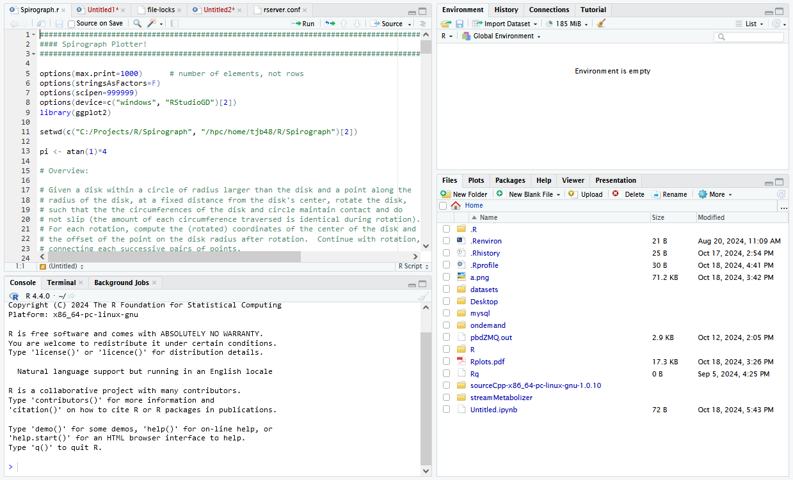

# Quick Start Guide for RStudio in Open OnDemand on the DCC

Go to https://dcc-ondemand-01.oit.duke.edu

Click on "Interactive Apps"

Select "RStudio Apptainer" to launch the RStudio session configurator:

<table>
<td>

</td>
</table>

Enter the Account and Partition for your lab, along with your required session duration (Wait Time), number of CPUs, and amount of memory
 
At the bottom of the page, click "Launch"

Under "My Interactive Sessions," a new RStudio Apptainer window will appear:

<table>
<td>

</td>
</table>

Notice the Time Remaining (until session termination, updated in real-time) 

Click "Connect to RStudio Server"

Your RStudio session and panels will appear:

 

Use the Upload and Export (under "More") feaures of the Files tab in the lower-right panel to upload and download files

Because home directories have limited space, it is suggested that files be uploaded into your lab's group directory.  Using the RStudio File tab:

1. Click the ellipsis button (three dots to the right)
2. Under "Path to folder" enter "/hpc/group/yourLab"
3. Use the "New Folder" button to create a directory with your netID

Use the ellipsis button (along with /hpc/group/yourLab/yourNetID) or the R command setwd("/hpc/group/yourLab/yourNetID") to access files in your lab directory

## Installing Packages

Because home directories have limited space, packages should be installed in your lab's group directory.  Create /hpc/group/yourLab/yourNetID, as described above, then create a subdirectory within it called "rlib."

The following R instructions install a package from the Duke CRAN mirror into the rlib subdirectory of /hpc/group/yourLab/yourNetID

[<div style="background-color: gray;">]: #
```
# Install ggplot2

# Specify Duke CRAN mirror
options("repos"="cran.r-project.org")

# Specify package installation and load path 
# Be sure to include this command whenever loading installed packages
.libPaths(c("/hpc/group/yourLab/yourNetID/rlib", .libPaths()))

# Install a package
install.packages("ggplot2")

# Load a package
library(ggplot2)

```
[</div>]: #

<a href="DCCRPackageInstallation-1.2.pdf">Additional information on installing packages from within DCC sessions</a>
